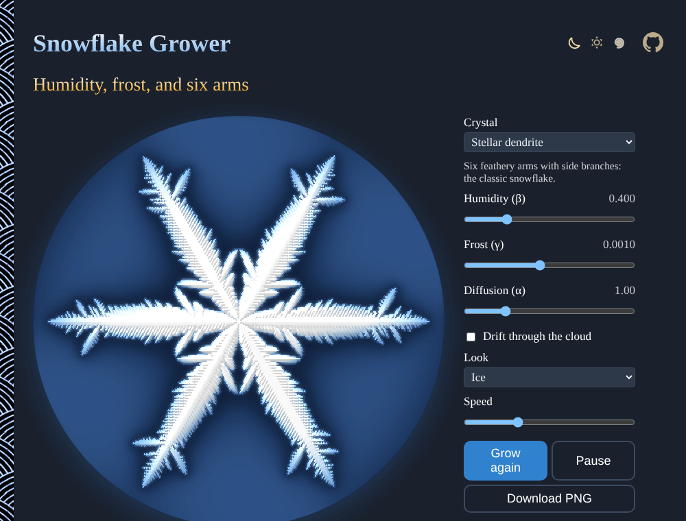
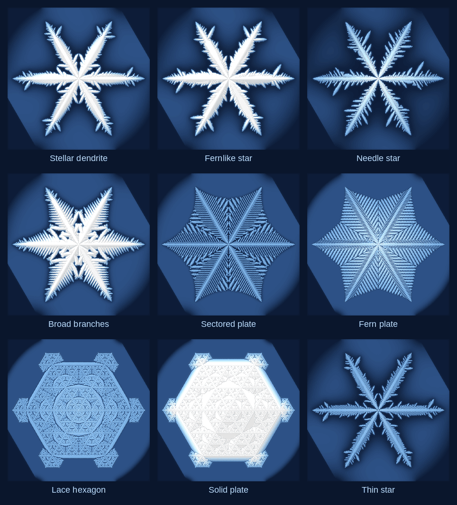

# Snowflake-Grower

Humidity, frost, and six arms: grow snow crystals live on a hexagonal grid, with Clifford Reiter's cellular automaton. Set the weather and get stellar dendrites, ferns, sectored plates or lace, or let the crystal drift through changing air, then download it as PNG. No sign-up and no libraries.

- [Grow a snowflake](https://evoluteur.github.io/snowflake-grower/)

## What it does

- **Crystal**: nine weathers that grow distinct snowflakes (Stellar dendrite, Fernlike star, Needle star, Broad branches, Sectored plate, Fern plate, Lace hexagon, Solid plate, Thin star).
- **Humidity** (&beta;, the water in the air), **Frost** (&gamma;, the water the cold adds to the ice edge) and **Diffusion** (&alpha;, how fast vapor spreads). Change them while the crystal grows to change the rest of its growth.
- **Drift through the cloud**: the weather wanders as the crystal grows, so each ring of it records different air.
- **Look**: Ice (thicker ice is whiter, and the dark halo shows the air the crystal has drained), Growth rings (colored by when each cell froze), or Paper cut.
- **Speed**, **Pause**, **Grow again**, and **Download PNG**. The address of the page keeps the weather, to share it.

## How it is built

The crystal grows on a 301 × 301 grid of hexagonal cells. Each step, the cells that are ice or touch ice keep their water and add &gamma; to it; the water of the other cells diffuses (each moves &alpha;/2 of the way to the average of itself and its six neighbors). A cell freezes when its water reaches 1. The air beyond the edge of the disk stays at the background humidity &beta;, an endless supply. This is the model of Clifford A. Reiter, *A local cellular model for snow crystal growth* (Chaos, Solitons & Fractals, 2005).

The cells are drawn with a lookup from each pixel to its hexagon, so the snowflake stays sharp at any size.

Plain HTML, CSS and JavaScript, with no dependencies and no build step. Just open `index.html`. The three color themes (dark, light and blue) are shared with my other projects (copied from [omg-themes](https://github.com/evoluteur/omg-themes)).

## A little history

Johannes Kepler wondered in 1611, in *On the Six-Cornered Snowflake*, why snow is always six-sided. Wilson Bentley photographed more than 5,000 snowflakes in Vermont from 1885 on, and found no two alike. Ukichiro Nakaya grew the first artificial snow crystals in his Hokkaido laboratory in 1936 and mapped their shapes against temperature and humidity in the Nakaya diagram; he called them "letters sent from the sky".

Snowflake-Grower is open source at [GitHub](https://github.com/evoluteur/snowflake-grower) with MIT license.

Had fun browsing the app? [Buy me a coffee by becoming a sponsor](https://github.com/sponsors/evoluteur).

You may also be interested in my other projects [Reaction-Diffusion](https://github.com/evoluteur/reaction-diffusion) ([demo](https://evoluteur.github.io/reaction-diffusion/)), [Sacred-Geometry](https://github.com/evoluteur/sacred-geometry) ([demo](https://evoluteur.github.io/sacred-geometry/)) and [Mandala-Maker](https://github.com/evoluteur/mandala-maker) ([demo](https://evoluteur.github.io/mandala-maker/)). See them all on [Esoterica](https://evoluteur.github.io/esoterica.html).

Copyright (c) 2026 [Olivier Giulieri](https://evoluteur.github.io/).
